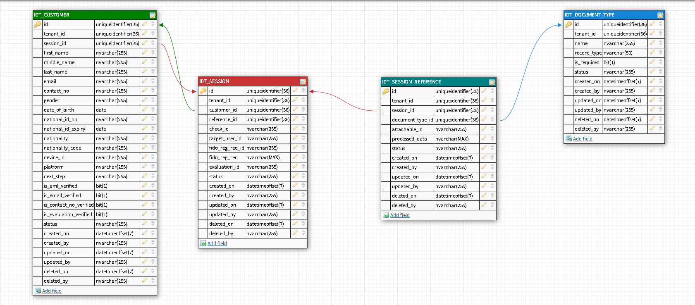

<p align="center">
  
</p>
<h1 align="center">Rubix | Identity  Service</h1>

<p align="center">
  
</p>

## Table of Contents

- [Tech](#-tech)
- [Getting Started](#-getting-started)
- [Features](#-features)
- [App Structure](#-app-structure)
- [Relational Schema](#-relational-schema)
- [Up and Running](#-up-and-running)
    - [Local Setup](#-local-setup)
    - [Docker Setup](#-docker-setup)
    - [Environment Variable Setup](#-environment-variable-setup)
- [Migrations & Seeding](#-migration-&-seeding)
- [Graphql Endpoints](#-graphql-endpoints)

<p align="center">
  
</p>

## ❯ Tech

* [node.js] - evented I/O for the backend
* [NestJS](https://docs.nestjs.com/) - fast node.js network app & microservices framework.
* [Knex](http://knexjs.org/) -  In addition, we're going to use Knex, which is a database query builder that will interface with the **MySQL**, **PostgreSQL**, **SQLite**, **MSSQL**, **Oracle** and **MariaDB** databases for us.
- [GraphQL](http://graphql.org/) provides as a awesome query language for our api.
- [DataLoaders](https://github.com/facebook/dataloader) helps with performance thanks to caching and batching.
- [Smart Validation](https://github.com/pleerock/class-validator) thanks to [class-validator] with some nice annotations.
- [Custom Validators](https://github.com/pleerock/class-validator#custom-validation-classes) to validate your request even better and stricter.
- [identity-api](https://github.com/aiondigital/identity-api) Wrapper package on top of the daon services.

## ❯ Getting Started
As an Identity Microservice it will follow the basics of microservice architecture and scoped with the identity-related features to capture customer identity, here are the details of this module:

- Facial Identity
  - Face recognition by selfie
  - Face liveness detection

- Document identity
  - National ID (Front & Back)
  - Passport
  - Driving License

## > Features

- Customer module
- Face uploading module
- Document uploading module
- Document processing module
- Evaluation module

## ❯ App Structure

```bash
├── dist
├── public
├── src
│   ├── app
│   │   ├── v1
│   │   │   ├── users
│   │   │   │   ├── user.class.ts
│   │   │   │   ├── user.dto.ts
│   │   │   │   ├── users.controller.ts
│   │   │   │   ├── users.controller.specs.ts
│   │   │   │   ├── users.module.ts
│   │   │   │   ├── users.resolver.ts
│   │   │   │   ├── users.service.ts
│   │   │   ├── v1.module.ts
│   │   ├── app.controller.ts
TY│   │   ├── app.contrller.spec.ts
│   │   ├── app.modules.ts
│   │   ├── app.service.ts
│   │   ├── index.ts
│   ├── common
│   │   ├── configuration
│   │   │   ├── configuration.service.ts
│   │   │   ├── configuration.service.spec.ts
│   │   │   ├── dbconfiguration.service.ts
│   │   ├── decorators
│   │   ├── filters
│   │   │   ├── http-exception.filter.ts
│   │   ├── interceptors
│   │   │   ├── logging.interceptor.ts
│   │   ├── interfaces
│   │   │   ├── configuration.interface.ts
│   │   │   ├── index.ts
│   │   ├── mappers
│   │   ├── pipes
│   │   ├── common.module.ts
│   │   ├── constant.ts
│   │   ├── utilities.ts
│   ├── core
│   │   ├── database
│   │   │   ├── factories
│   │   │   ├── migrations
│   │   │   │   ├── 20200625222904_create_users_table.ts
│   │   │   ├── seeds
│   │   ├── middlewares
│   │   │   ├── index.ts
│   │   │   ├── kernel.middleware.ts
│   │   ├── providers
│   │   │   ├── index.ts
│   │   │   ├── swagger.middleware.ts
│   │   ├── repository
│   │   │   ├── base.repository.ts
│   │   │   ├── index.ts
│   │   │   ├── repository.module.ts
│   │   │   ├── user.repository.ts
│   │   ├── server.ts
│   ├── main.ts
├── test
│   ├── app.e2e.spec.ts
│   ├── jest.e2e.ts
├── .env
├── .env.example
├── .gitignore
├── .ncurc.json
├── .prettierrc
├── database.ts
├── schema.gql
├── nest-cli.json
├── nodemon.json
├── package.json
├── README.md
├── tsconfig.json
├── tsconfig.build.json
└── eslintrc.js
```

## ❯ Relational Schema

<p align="center">
  
</p>


## ❯ Up and Running

You must install the following on your local machine:

1. Node.js (v12.x recommended)
2. Docker
3. Docker Compose
4. Database Client (MSSQL | MySQL | Postgres | Oracle)

### Environment Variables Setup

| Name  |  Default Value  | Description
|---|---|---|
| NODE_ENV  |development|Node Environment  (production, development, staging, testing)
| ENV_RBX_APP_NAME  |Identity Service| Name of the  service
| ENV_RBX_API_URL_PREFIX  | api/v1  | API url prefix  |
| ENV_RBX_PORT  |   |Port number where the server is listing|
| ENV_RBX_DB_USERNAME  |   | Username of the database |
| ENV_RBX_DB_PASS  |   | Password of the database   |
| ENV_RBX_DB_NAME  |   |  Name of the database |
| ENV_RBX_DB_HOST  |   | Hostname of the database  |
| ENV_RBX_DB_PORT  |   |  Port number of the database |
| ENV_RBX_DB_TIMEOUT  |   | Database timeout value in miliseconds |
| ENV_RBX_DB_DEBUG  |  false | if the value of this varibale is `true` then knex database connectivity establish in debug mode.  |
| ENV_RBX_SWAGGER_ENABLED  |  false | This variable is used to publish the swagger documentation  |
| ENV_RBX_SWAGGER_ROUTE  |/api/docs   |  This variable is used to change the swagger api documentation route. |
| ENV_RBX_GRAPHQL_DEBUG  | false  | This variable is to used to run graphql in debug mode |
| ENV_RBX_GRAPHQL_PLAYGROUND  | false  | This variable is used for graphql query interface  |
| ENV_RBX_IDENTITYX_BASE_URL  |   |  Base URL of the daon server |
| ENV_RBX_IDENTITYX_API_VERSION  |   | API version of the daon server, like (v1, v2)  |
| ENV_RBX_IDENTITYX_TOKEN  |   |  Basic auth token of the daon server |
| ENV_RBX_IDENTITYX_TENANT  |   | Tenant name of the daon server   |
| ENV_RBX_IDENTITYX_USERNAME  |   |  If you don't want  to authenticate service with `ENV_RBX_IDENTITYX_TOKEN` then you can specift the daon username|
| ENV_RBX_IDENTITYX_PASSWORD  |   | If you don't want  to authenticate service with `ENV_RBX_IDENTITYX_TOKEN` then you can specift the daon password  |
| ENV_RBX_IDENTITYX_REG_POLICY  |   | Registration Policy of the daon server  |
| ENV_RBX_IDENTITYX_APPLICATION  |   |  Application ID of the daon server |
| ENV_RBX_IDENTITYX_EVALUATION_POLICY  |   |  Evaluation policy of the DAON server |
| NODE_TLS_REJECT_UNAUTHORIZED  |   |  set value to `0` if you are running your server on http |

Export environment variables through terninals
```
$ export NODE_ENV=development
$ export ENV_RBX_APP_NAME=Rubix | Identity Service
$ export ENV_RBX_PORT=3000
```
Or rename the `env.example` to `.env` update the values file for your environment
```
NODE_ENV=development
ENV_RBX_APP_NAME=Rubix | Identity Service
ENV_RBX_PORT=3000
```

### Local Setup
Install the dependencies and devDependencies and start the server.

```sh
# Get the latest snapshot
$ git clone https://<username>@github.com/aiondigitalengineering/rubix.git

# Change directory
$ cd ./rubix/retail/middleware/identity.service/

# To install NodeJS dependencies.
$ npm install 

# To run the node server
$ npm run start:dev

```

### Docker Setup
Build and run identity service container.

```sh
# Get the latest snapshot
$ git clone https://<username>@github.com/aiondigitalengineering/rubix.git

# Change directory
$ cd ./rubix/retail/middleware/identity.service/

# To build the docker image
$ docker build  --no-cache  --force-rm -t rubixretailidentity:dev .

# To run the rubixretailidentity:dev container
$ sudo docker run -d rubixretailidentity:dev

```

Once the start script is done.

- The GraphQL Playground will be running on [http://localhost:3000/graphql](http://localhost:3000/graphql)
- The Swagger OpenAPI Specification will be running on [http://localhost:3000/api/docs](http://localhost:3000/api/docs)

# Migrations & Seeding

We can run the below command performing a migration and updating our local database:

```bash
$ npm run db:migrate
```

To rollback the last migration run the below following command.

```bash
$ npm run db:rollback
```

## Test

```bash
# unit tests
$ npm run test

# e2e tests
$ npm run test:e2e

# test coverage
$ npm run test:cov
```

## ❯ Roadmap

- [x] Multiple Database client support
- [x] Add graphql
- [x] Add Swagger OpenAPI specification
- [x] Add DataLoader support
- [x] Docker Containerization
- [ ] Add authorization
- [ ] Add caching
- [x] Add health checks
- [ ] Add unit tests
- [ ] Improve logging
- [ ] Improve error handling
